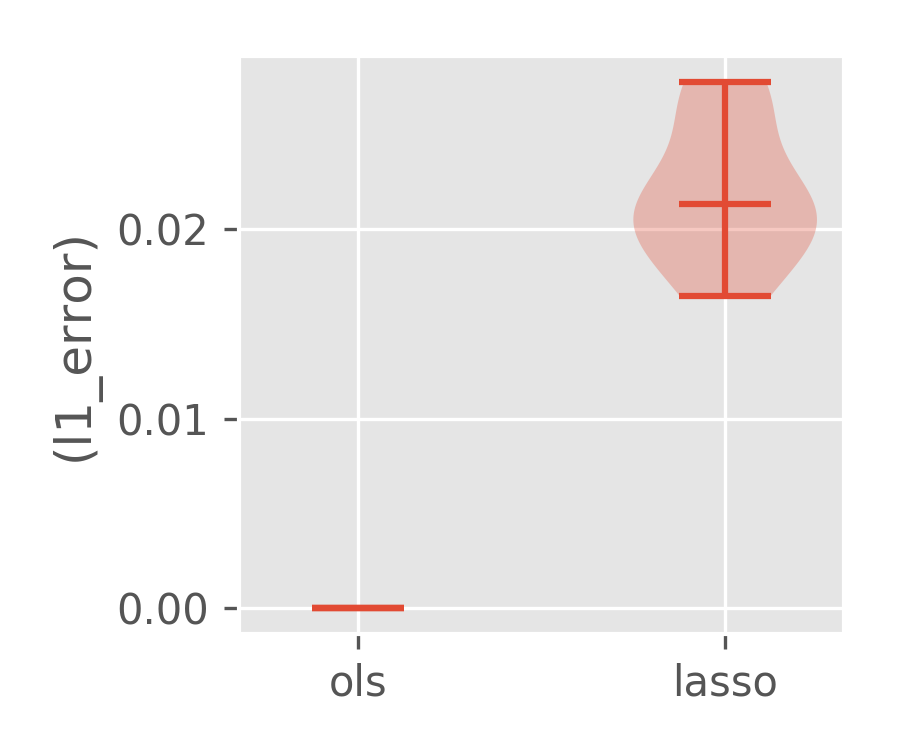
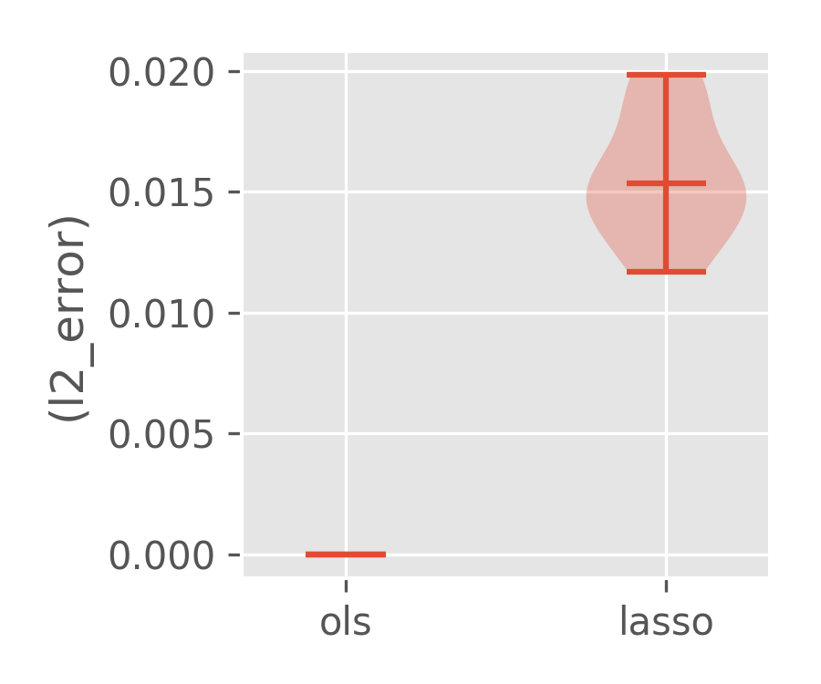
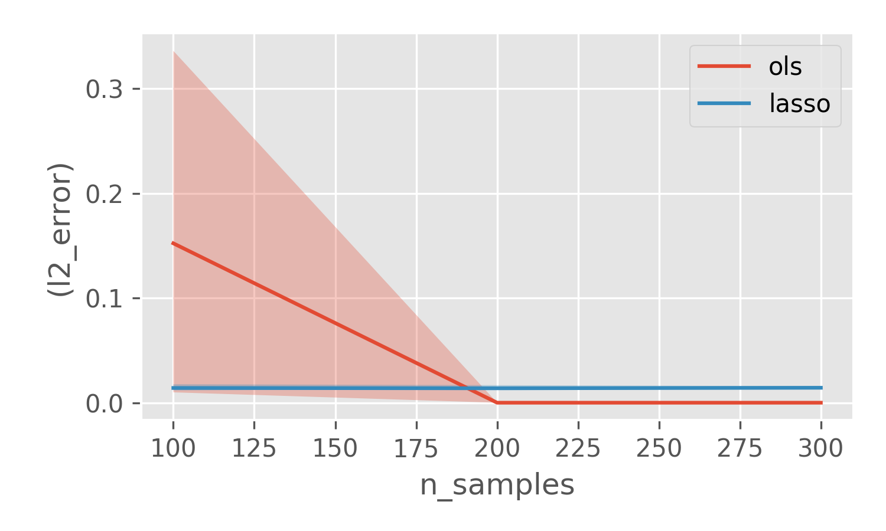
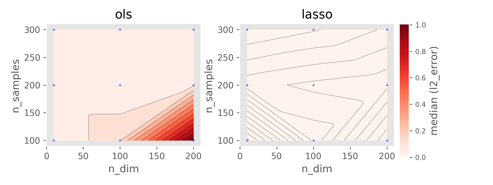
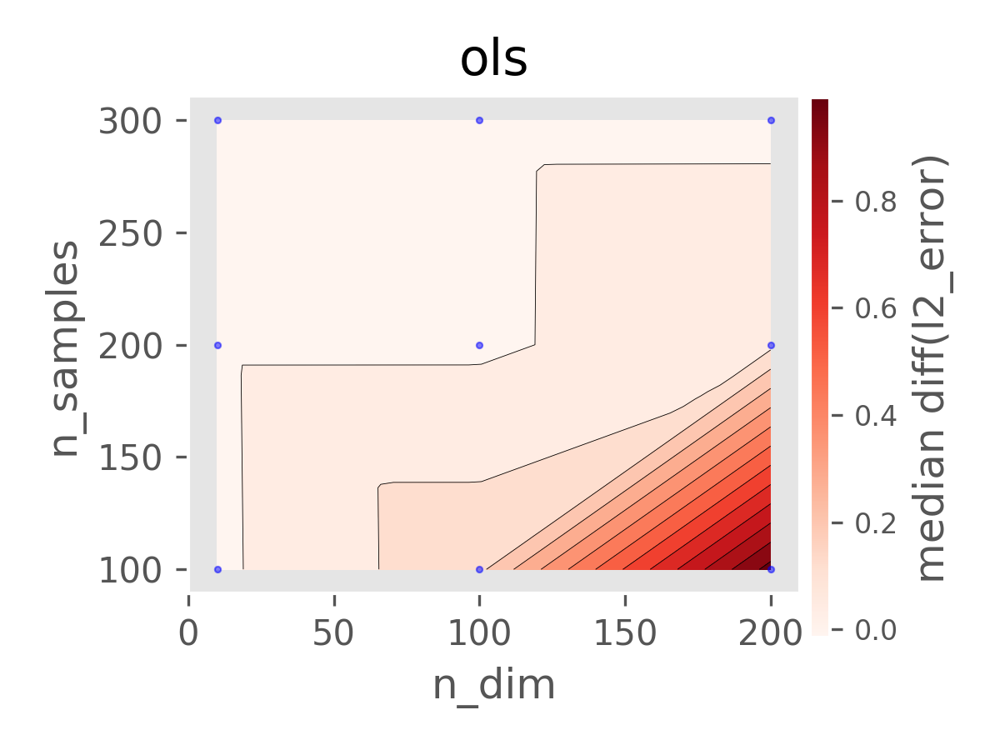

# MCPY library
The library folder ```mcpy``` contains library code related to running generic monte carlo experiments from config files and saving and running the results. 
Check out the notebook ```example_mcpy.ipynb``` for a simple example of how to use the library.

A simple config dictionary allows you to run monte carlo experiments for some configuration of the parameters of the dgp and the estimation methods and allows you to specify arbitrary methods to use to estimate for each sample, arbitrary set of dgps to use to generate samples, arbitrary metrics to evaluate, and arbitrary plots to create from the experimental results. The monte carlo class will run many experiments, each time generating a sample from each dgp, running each estimation method on each sample and calculating each metric on the returned result. Subsequently the plotting functions receive the collection of all experimental results and create figures. The package offers a basic set of plotting functions but the user can define their own plotting functions and add them to their config dictionary. See e.g. `config_games_py_example`, `config_logistic.py_example` and `config_missing_data.py_example` for sample config variable definitions.

Consider the following simple example: suppose we want to generate data from a linear model and test the performance of OLS and Lasso for estimating the coefficients and as the dimension of the features changes. We can then create a dgp function that takes as input a dictionary of options and returns a data-set and the true parameter:
```python
def dgp(dgp_opts):
    true_param = np.zeros(opts['n_dim'])
    true_param[:opts['kappa']] = 1.0
    x = np.random.normal(0, 1, size=(opts['n_samples'], opts['n_dim']))
    y = np.matmul(x, true_param)
    return (x, y), true_param
```
Then we also define two functions that take as input a data-set and a dictionary of options and return the estimated coefficient based on each method:
```python
def ols(data, method_opts):
    x, y = data
    from sklearn.linear_model import LinearRegression
    return LinearRegression().fit(x, y).coef_

def lasso(data, method_opts):
    x, y = data
    from sklearn.linear_model import Lasso
    return Lasso(alpha=opts['l1_reg']).fit(x, y).coef_
```
Now we are ready to write our config file that will specify the monte carlo simulation we want to run as well as the metrics of performance to compute and the plots to generate at the end:
```python
from mcpy import metrics
from mcpy import plotting
CONFIG = {
    # Functions to be used for data generation
    'dgps': {'linear_dgp': dgp},
    # Dictionary of parameters to the dgp functions
    'dgp_opts': {'n_dim': 10, 'n_samples': 100, 'kappa': 2},
    # Estimation methods to evaluate
    'methods': {'ols': ols, 'lasso': lasso},
    # Dictionary of parameters to the estimation functions
    'method_opts': {'l1_reg': 0.01},
    # Metrics to evaluate. Each metric takes two inputs: estimated param, true param
    'metrics': {'l1_error': metrics.l1_error, 'l2_error': metrics.l2_error},
    # Options for the monte carlo simulation
    'mc_opts': {'n_experiments': 10, 'seed': 123},
    # Which of the methods is the proposed one vs a benchmark method. Used in plotting
    'proposed_method': 'lasso',
    # Target folder for saving plots and results
    'target_dir': 'test_ols',
    # Whether to reload monte carlo results from the folder if results with
    # the same config spec exist from a previous run
    'reload_results': False,
    # Which plots to generate. Could either be a dictionary of a plot spec or an ad hoc plot function. 
    # A plot spec contains: {'metrics', 'methods', 'dgps', 'metric_transforms'}, 
    # that specify a subset of each to plot (defaults to all if not specified).
    # An ad hoc function should be taking as input (param_estimates, metric_results, config)
    'plots': {'all_metrics': {}, 'param_hist': plotting.plot_param_histograms}
}
```
We can then run this monte-carlo simulation as easy as:
```python
from mcpy.monte_carlo import MonteCarlo
estimates, metric_results = MonteCarlo(CONFIG).run()
```
This code will save the plots in the target_dir. In particular it will save the following two figures that depict the distribution of l1 and l2 errors across the 10 experiments:

<p align="center">
  
  
</p>

A sweep config dictionary, allows you to specify for each dgp option a whole list of parameters, rather than a single value. Then the MonteCarloSweep class will execute monte carlo experiments for each combination of parameters. Subsequently the plotting functions provided can for instance plot how each metric varies as a single parameter varies and averaging out the performance over the settings of the rest of the parameters. Such plots are created for each dgp and metric, and each plot contains the results for each method. This is for instance used in the case of the linear treatment effect experiment. See e.g. `sweep_config_linear.py_example` for a sample sweep-config variable definition.

For instance, back to the linear example, we could try to understand how the l1 and l2 errors change as a function of the dimension of the features or the number of samples. We can perform such a sweeping monte carlo by defining a sweep config:
```python
SWEEP_CONFIG = {
    'dgps': {'linear_dgp': dgp},
    'dgp_opts': {'n_dim': [10, 100, 200], 'n_samples': [100, 200, 300], 'kappa': 2},
    'methods': {'ols': ols, 'lasso': lasso},
    'method_opts': {'l1_reg': 0.01},
    'metrics': {'l1_error': metrics.l1_error, 'l2_error': metrics.l2_error},
    'mc_opts': {'n_experiments': 10, 'seed': 123},
    'proposed_method': 'lasso',
    'target_dir': 'test_sweep_ols',
    'reload_results': False,
    # Let's not plot anything per instance
    'plots': {},
    # Let's make some plots across the sweep of parameters
    'sweep_plots': {
        # Let's plot the errors as a function of the dimensions, holding fixed the samples to 100
        'var_dim_at_100_samples': {'varying_params': ['n_dim'], 'select_vals': {'n_samples': [100]}},
        # Let's plot the errors as a function of n_samples, holding fixed the dimensions to 100
        'var_samples_at_100_dim': {'varying_params': ['n_samples'], 'select_vals': {'n_dim': [100]}},
        # Let's plot a 2d contour of the median metric of each method as two parameters vary simultaneously
        'var_samples_and_dim': {'varying_params': [('n_samples', 'n_dim')]},
        # Let's plot the difference between each method in a designated list with the 'proposed_method' in the config
        'error_diff_var_samples_and_dim': {'varying_params': [('n_samples', 'n_dim')], 'methods': ['ols'], 
                                           'metric_transforms': {'diff': metrics.transform_diff}}
    }
}
```
We can then run our sweeping monte carlo with the following command:
```python
from mcpy.monte_carlo import MonteCarloSweep
sweep_keys, sweep_estimates, sweep_metric_results = MonteCarloSweep(SWEEP_CONFIG).run()
```
The sweep plots allows you to define which types of plots to save as some subset of parameters vary while others take a subset of the values.
For instance, the above four sweep plots will create 8 plots, one for each metric. The four plots corresponding to the l2 error are as follows:
<p align="center">
  
  
  
  
</p>
Showing how lasso out-performs ols when the number of samples is smaller than the dimension.

